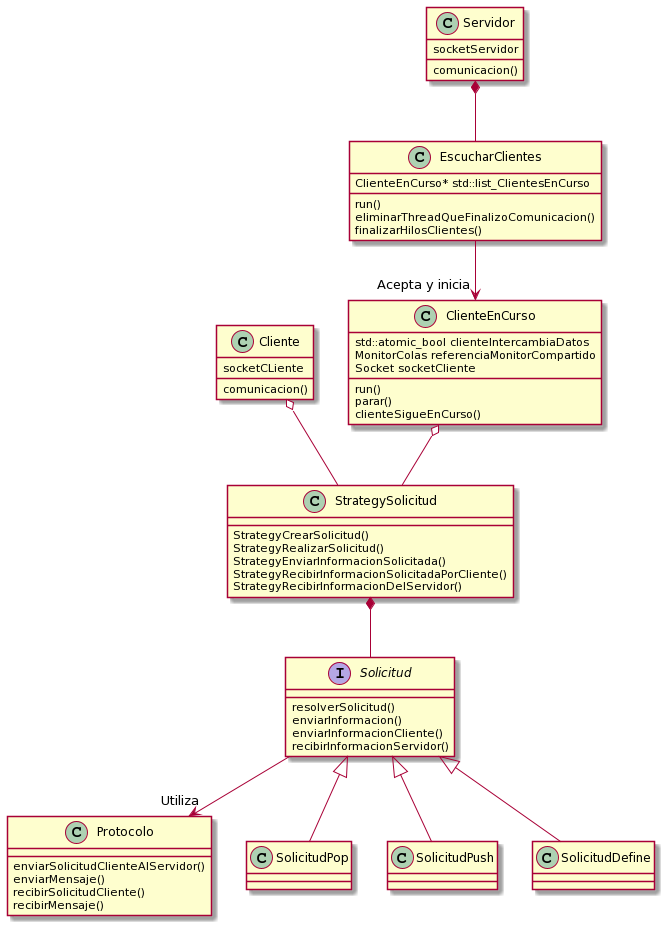
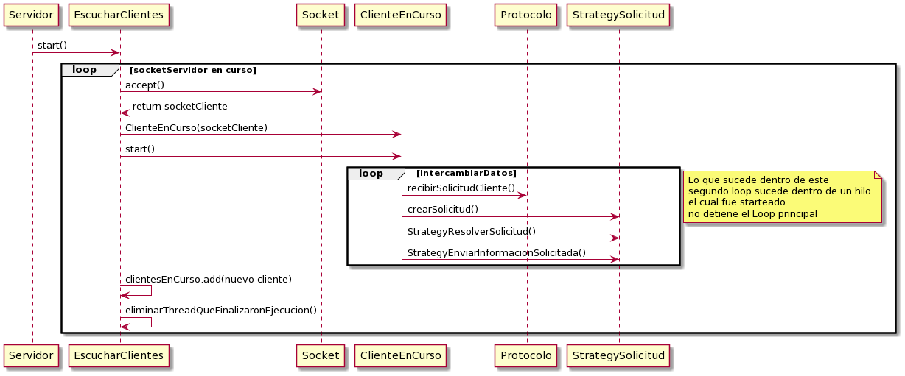
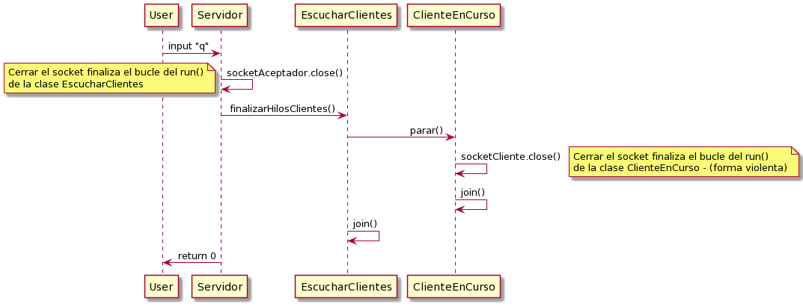

 # TRABAJO PRACTICO - MIDDLEWARE
 
Alumno: Jesus Andres Correa Tornero

Padrón: 102310

Link : https://github.com/andy0013/TP3

# Introducción

El trabajo practico consiste en la creacion de un servidor, desde el cual sea posible aceptar varios clientes en paralelo, los cuales podran enviar mensajes para realizar solicitudes respetando un protocolo de comunicacion, debe de haber un manejo correcto de errores, en aquellas situaciones donde por un mensaje mal enviado o la falla de distintas conexiones no se detenga la ejecucion del programa, sino que sepa como manejarlo.

# MODELO

 
 

 Para nuestra implementacion del trabajo practico nos basamos en el modelo cliente-servidor presentado en la clase, es decir, tenemos un hilo main el cual espera el input corroborando que el ingreso sea "q", en la clase **Servidor** ;en ese caso se cerrara el socketAceptador. 
 Tambien, dentro del servidor, se lanzara un hilo el cual escucha clientes **EscucharClientes**, representado el en Diagrama mostrado previamente, este hilo acepta clientes **ClientesEnCurso**, y los lanza a correr, estos mismos intercambian informacion con el cliente.
 
 Los ClientesEnCurso utilizan una interfaz **Solicitud** para definir que comportamiento utilizaran, para esto hace uso de la clase **StrategySolicitud** y de la clase **Protocolo** en caso de necesitar recibir informacion del cliente, y de tener que enviar informacion al mismo. 

Asi mismo, del lado del **Cliente** tambien hacemos uso de la clase **StrategySolicitud** para definir que tipo de informacion se enviara al servidor y al cliente, por lo que, estas clases son de uso compartido, y tienen la logica de lo que se hara en cada caso, del lado del __Cliente__ y del lado del __Servidor__.

# SECUENCIA SERVIDOR CORRIENDO

 

En el primer caso, vemos cuando inicia el ./server. En esta situacion se inicia el hilo que escucha clientes *EscucharClientes*, el mismo realiza un loop en el cual acepta clientes, esta operacion es bloqueante, por lo que esperara a que un cliente intente conectarse. Una vez acepta a un cliente, recibe el SocketCliente y con este Socket, lanza el hilo *CLienteEnCurso* el cual recibe como parametro su Socket y el Monitor de donde se obtendran datos para modificar los mismos.

# SECUENCIA SERVIDOR FIN

 

En este caso mostramos el flujo de finalizar de los clientes. Podemos ver que cuando se ingresa una "q", el hilo main que estaba esperando el input no realiza llamado a otra funcion mas que a cerrar el socket servidor, luego, continuando su flujo, ya que la misma se encuentra en el main - stack, va a finalizar, pero para esto, debe llamar al destructor de la clase *EscucharClientes*, y este mismo destructor se ocupa de finalizar hilos en curso - liberar memoria, y joinearse a si mismo, antes de destruirse. 

# PROBLEMAS EN DESARROLLO - SITUACIONES PARTICULARES
